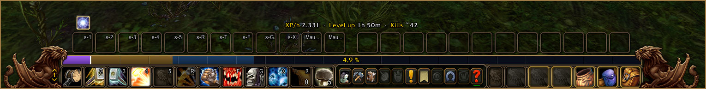
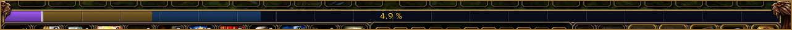
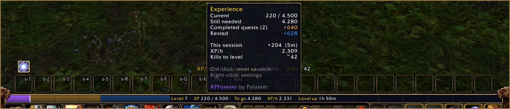
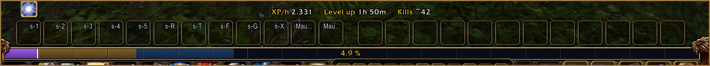
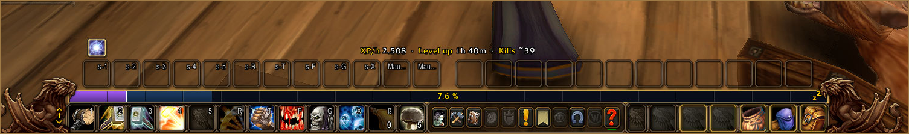
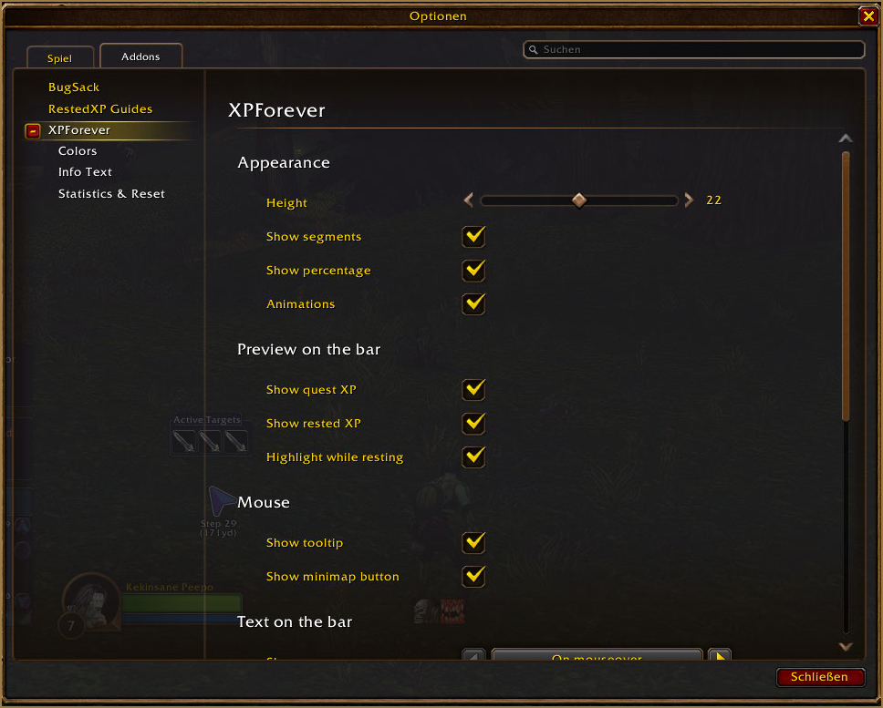
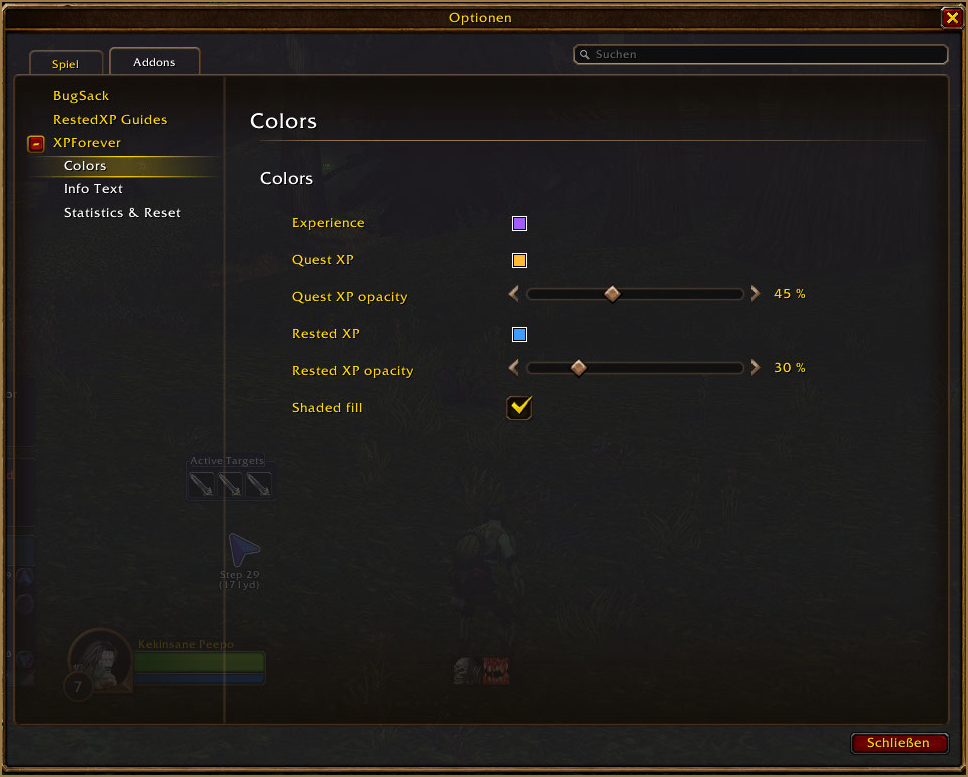
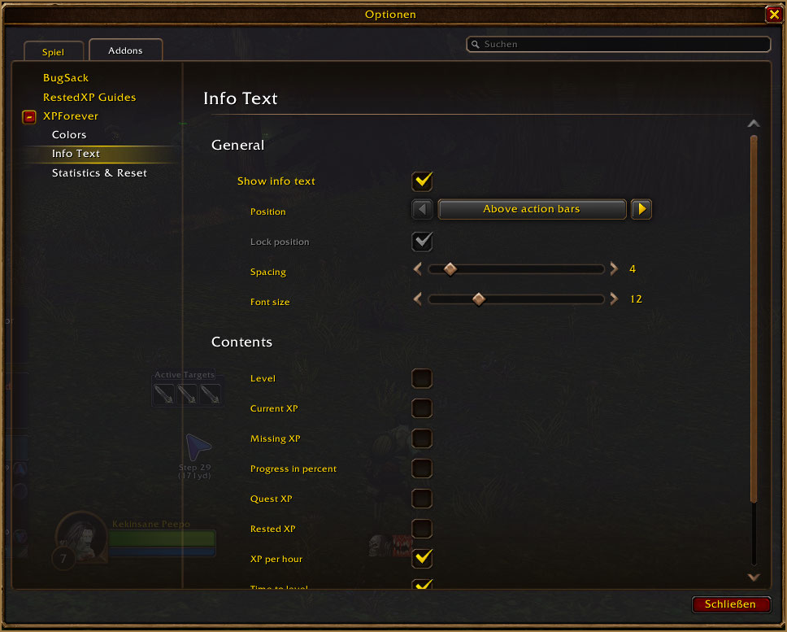

# XPForever

**A cleaner, smarter experience bar for World of Warcraft: Forever.**
See your XP, quest XP and rested XP at a glance – plus XP per hour, time to level and kills to level.

<!-- Badges werden aktiviert, sobald die CurseForge-Projekt-ID feststeht:

-->

by **Palanim**

## Highlights

- **A bar you can read** – thicker than the default bar, in the Forever style, with 20 segments
- **Quest XP preview** – see how much XP your completed quests give before you turn them in
- **Rested XP preview** – see exactly how far your rested bonus reaches
- **XP per hour, time to level, kills to level** – right above your action bars
- **Rested indicator** – a subtle golden glow and “Zzz” while you rest in an inn or a city
- **Smooth animations** when you gain XP or level up
- **Fully configurable** – colors, opacity, texts, position, all in *Options → AddOns*
- **Lightweight** – nothing runs while nothing happens (`/xpf perf` shows it)
- English and German

## Features

### The experience bar

Your XP, the XP from completed quests and your rested XP in clear, separate colors. Quest XP and rested XP are shown as a subtle preview behind your XP, so you always know where the next turn-in takes you. The percentage sits in the middle of the bar.

### Details on mouseover

Hover the bar to see your level, XP, missing XP, XP per hour and time to level directly on the bar – plus a tooltip with all the details of your session. You choose which values appear.

### Info text

A single line above your action bars with the values you care about: XP per hour, time to level, kills to level, quest XP, rested XP and more. It follows your action bars automatically, or you place it anywhere you like.

### Kills to level

XPForever learns how much XP your recent kills gave you and estimates how many more you need. Quest turn-ins are recognized and left out, so the estimate stays honest.

### Resting

While you rest in an inn or a city, the frame of the bar glows softly in gold and a small “Zzz” appears – the same style as the player frame.

### Settings

Everything is configurable in *Options → AddOns → XPForever*: height, segments, colors and opacity, what the bar text and the info text show, how XP per hour is calculated and more.

### Minimap button

Drag it around the minimap. Left-click opens the settings, right-click shows or hides the info text, and the tooltip gives you a quick summary. Don't like minimap buttons? Turn it off – XPForever is also listed in the addon menu at the minimap.
## Usage

| Action | Effect |
|---|---|
| Hover the bar | Show the bar text and the tooltip |
| <kbd>Ctrl</kbd>-click the bar | Reset session statistics |
| Right-click the bar | Open settings |
| `/xpf` | Open settings |
| `/xpf reset` | Reset session statistics |
| `/xpf perf` | Show CPU time and memory usage |

## FAQ

**Can I move the bar?**
Yes – XPForever follows Blizzard's experience bar. Move it in Edit Mode and the bar moves with it.

**What happens when I track a reputation?**
Blizzard shows the reputation bar in its own place, and XPForever stays on the experience bar.

**Why does it say “–” for XP per hour or kills?**
XPForever needs a minute of play time for XP per hour and at least one kill for the kill estimate.

**Does it work at max level?**
At max level the bar hides itself, just like Blizzard's experience bar.

## Feedback

Found a bug or have an idea? Please [open an issue](https://github.com/palanimForever/XPForever/issues).

## Credits

XPForever is made by **Palanim**. It embeds [LibStub](https://www.wowace.com/projects/libstub), [CallbackHandler-1.0](https://www.wowace.com/projects/callbackhandler), [LibDataBroker-1.1](https://github.com/tekkub/libdatabroker-1-1) and [LibDBIcon-1.0](https://www.curseforge.com/wow/addons/libdbicon-1-0) for the minimap button.

## License

MIT – see [LICENSE](LICENSE). Embedded libraries keep their own licenses.
